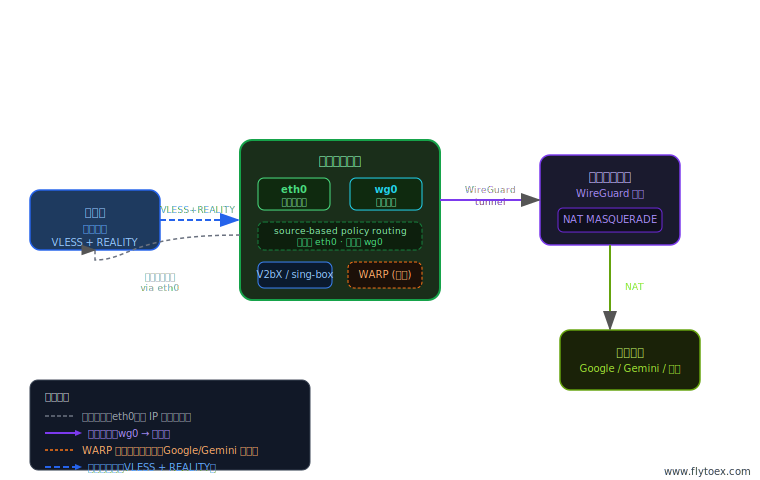
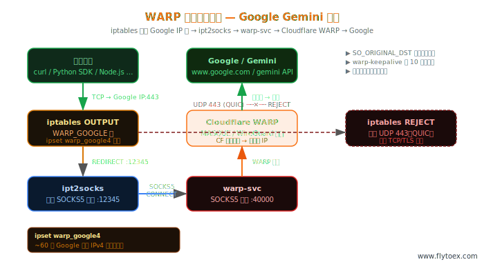

# FLYTOex Network — 香港节点运维工具集

[](https://github.com/panwudi/flyto-network)
[](https://github.com/panwudi/flyto-network)
[](https://www.flytoex.com)

香港中转节点部署工具，集成 WireGuard 中转配置、V2bX 代理节点管理、Cloudflare WARP 透明代理（可选），支持 Google/Gemini 与 OpenAI/Claude 分流送中，配置加密保存与一键恢复。

---

## 整体架构



香港节点同时承载两类流量，通过 source-based policy routing 严格分离：

| 流量类型 | 正确出口 | 违反后果 |
|---------|---------|---------|
| 客户端入站的**回包**（SSH、VLESS 回包） | `eth0`（原路返回） | 连接不对称 → 间歇断连 |
| 香港节点**代理发起**的新连接 | `wg0` → 美国出口 | 出口变成香港 IP → Gemini 地区受限 |

---

## 目录结构

```
flyto-network/
├── flyto.sh              # 统一入口（交互菜单 + 命令行）
├── Makefile              # 仓库级检查入口（make check）
├── modules/
│   ├── hk-setup.sh       # 香港节点部署（WireGuard + V2bX）
│   └── warp.sh           # WARP 透明代理（Google Gemini 送中）
├── scripts/
│   └── check.sh          # 仓库级语法与结构检查
├── secrets.enc           # AES-256 加密的面板配置
├── tools/
│   └── gen-secrets.sh    # 管理 secrets.enc 的工具
├── docs/
│   ├── topology.svg      # 整体网络拓扑图
│   ├── warp-topology.svg # WARP 链路拓扑图
│   ├── ARCHITECTURE.md   # 执行流、模块关系、运行时配置图
│   ├── RISK-AUDIT.md     # 风险与可维护性审计
│   └── DEVELOPMENT.md    # 仓库结构与维护约定
├── LICENSE
└── README.md
```

## 架构与维护文档

- [docs/ARCHITECTURE.md](docs/ARCHITECTURE.md) — 项目执行流、模块关系、运行时配置落盘图
- [docs/RISK-AUDIT.md](docs/RISK-AUDIT.md) — 风险点、维护成本和建议改进顺序
- [docs/DEVELOPMENT.md](docs/DEVELOPMENT.md) — 仓库工程结构和开发约定

---

## 快速开始

```bash
# 一键在线安装并启动（无需 git）
curl -fsSL https://raw.githubusercontent.com/panwudi/flyto-network/main/install.sh | sudo bash
```

默认会把仓库内容下载到 `/opt/flyto-network`，然后进入该目录并执行 `flyto.sh`。
首次运行需输入解密口令以读取面板配置，解密结果缓存于 `/etc/flyto/.secrets`（权限 600），后续无需重复输入。

如需只下载、不立即启动：

```bash
curl -fsSL https://raw.githubusercontent.com/panwudi/flyto-network/main/install.sh | sudo bash -s -- --download-only
```

如需保留传统方式，也可以：

```bash
git clone https://github.com/panwudi/flyto-network.git
cd flyto-network
sudo bash flyto.sh
```

开发者可在仓库内运行基础检查：

```bash
make check
```

---

## 功能模块

### 一、香港节点部署

**系统要求：** Debian 12（推荐），其他 Debian/Ubuntu 可用

**准备工作：** 在美国出口节点执行 `wg show`，记录以下信息：

- 香港节点 WG 私钥与隧道地址
- 美国节点 WG 公钥与 Endpoint（IP:端口）
- V2bX 节点 ID（从面板获取）

**部署流程：**

```
步骤 1/6  基础系统配置
          apt upgrade · lo 接口修复 · 禁用 IPv6 · 开启 IPv4 转发
          禁用 systemd-resolved · 锁定 resolv.conf · 启用 nftables

步骤 2/6  采集本机网络信息（自动探测，人工确认）
          WAN 接口 · 默认网关 · 公网 IP

步骤 3/6  输入 WireGuard 配置
          全新安装：逐字段输入
          恢复模式：整块粘贴备份内容

步骤 4/6  生成 wg0.conf 并启动 WireGuard

步骤 4b   三项自动验证（全部通过才继续）
          ① WG 握手时间 < 5 分钟
          ② 出口 IP 地区 = US
          ③ 回包路径 dev = eth0

步骤 5/6  安装 V2bX，覆盖面板配置

步骤 6/6  部署面板 IP 定时监控（cron，每小时 :05 分）

可选步骤  安装 WARP（Google Gemini 送中）
```

**为什么 `Table = off`**

`AllowedIPs = 0.0.0.0/0` 时，若不加 `Table = off`，`wg-quick up` 会自动接管默认路由，导致 SSH 立即断开，且 WireGuard Endpoint 的封包也会尝试走 `wg0`（自环）。加 `Table = off` 后，所有路由由 PostUp 精确手动写入。

**为什么需要面板 IP 例外路由**

V2bX 通过 `panel.flytoex.net` 拉取节点配置，若该域名没有例外路由，流量会经 `wg0` 出美国，面板可能因来源 IP 非预期而拒绝，或因 wg0 握手未就绪而超时。

---

### 二、WireGuard 路由设计

核心机制是 `source-based policy routing`，确保回包和出站走不同路径：

```
PostUp 写入的路由规则（按优先级）:

① ip rule add pref 100 from <HK_PUB_IP>/32 lookup eth0rt
   → 以香港公网 IP 为源的包（即入站回包），查 eth0rt 表，走 eth0

② ip route add <US_PUB_IP>/32 via <HK_GW> dev <HK_WAN_IF>
   → WireGuard Endpoint（美国公网 IP）强制走 eth0，防止隧道自环

③ ip route add <PANEL_IP>/32 via <HK_GW> dev <HK_WAN_IF>
   → 面板直连，防止 V2bX 拉配置走 wg0 失败

④ ip route replace default dev wg0
   → 所有其他主动出站（代理请求）走 wg0 → 美国出口
```

**sing-box `direct` 的实际路径**

sing-box 的 `direct` 出站在此架构下并非"香港直出"，而是经系统路由走 `wg0` 出美国。sing-box 不做任何路由决策，路由完全由 Linux 内核完成。

---

### 三、WARP 透明代理（可选）



在香港服务器上安装 Cloudflare WARP，形成两条并行通道：

- Google/Gemini：通过 iptables + ipset 按官方 IP 段透明转发
- OpenAI/Claude：通过 V2bX 内嵌 sing-box 按社区域名清单路由到本地 WARP SOCKS5

因此服务器上程序访问 Google / OpenAI / Claude 相关服务均可直接复用系统链路，**无需业务代码改造**。

#### 独立运行

```bash
sudo bash modules/warp.sh
```

#### 管理命令

| 命令 | 说明 |
|------|------|
| `warp status` | 状态（含 Google 连通性横幅） |
| `warp start / stop / restart` | 启动 / 停止 / 重启 |
| `warp test` | 8 层逐层诊断 |
| `warp debug` | 原始诊断（日志/端口/规则） |
| `warp ip` | 查看直连 IP 与 WARP IP |
| `warp update` | 更新 Google IP 段 |
| `warp uninstall` | 完整卸载 |

#### 端口配置

所有端口从 `/etc/warp-google/env` 读取，安装时自动生成，不再写死：

```
WARP_PROXY_PORT=40000   # warp-svc SOCKS5 端口
TPROXY_PORT=12345       # ipt2socks 透明代理监听端口
```

修改后执行 `warp restart` 即可生效，无需重装。

#### 透明代理后端

安装时自动探测，优先级：

1. **ipt2socks**（首选）— 专为 `iptables REDIRECT → SOCKS5` 设计，静态二进制，无依赖，自动下载 x86_64 / aarch64 版本
2. **Python asyncio tproxy**（fallback）— ipt2socks 下载失败时自动启用，纯标准库，零额外依赖

查看当前后端：`cat /etc/warp-google/tproxy_backend`

#### OpenAI / Claude 域名路由

- 数据源：`MetaCubeX meta-rules-dat` + `v2fly domain-list-community` 的 `openai`、`anthropic` 列表并集去重
- 目标：写入 `/etc/V2bX/sing_origin.json`，命中域名走 `warp-ai`（SOCKS5 -> WARP）
- 同步脚本：`/usr/local/bin/update-ai-warp-route.sh`

可手动刷新（例如 WARP 端口变化、想立即更新社区域名规则）：

```bash
/usr/local/bin/update-ai-warp-route.sh
```

---

## 配置加密管理

面板 ApiHost 和 ApiKey 加密保存在 `secrets.enc`，使用 AES-256-CBC + PBKDF2（100000 次迭代）加密，可安全提交至 Git 仓库。

```
flowchart：
  首次运行 flyto.sh
      ↓
  提示输入解密口令
      ↓
  openssl 解密 secrets.enc
      ↓
  明文写入 /etc/flyto/.secrets（chmod 600，仅 root 可读）
      ↓
  后续运行直接读缓存，无感知
```

**更新配置 / 更换口令：**

```bash
sudo bash tools/gen-secrets.sh
```

**清除解密缓存（下次运行重新输入口令）：**

```bash
sudo bash flyto.sh --clear-cache
```

---

## 备份与恢复

### 备份（系统重装前执行）

```bash
sudo bash flyto.sh backup
```

输出示例：

```
HK_PRIV_KEY=<私钥>
HK_PUB_KEY=<公钥>
HK_WG_ADDR=10.0.0.3/32
HK_WG_PEER_PUBKEY=<美国节点公钥>
HK_WG_ENDPOINT=5.6.7.8:51820
HK_WAN_IF=eth0
HK_GW=1.2.3.1
HK_PUB_IP=1.2.3.4
```

> ⚠️ 私钥极度敏感，请保存在本地加密存储（KeePass、1Password 等）中，不要通过聊天/邮件/截图传输。

### 恢复（重装完成后执行）

```bash
sudo bash flyto.sh restore
```

运行后选择恢复模式，将备份内容整块粘贴，脚本自动解析所有字段。

---

## 系统要求

| 项目 | 要求 |
|------|------|
| 操作系统 | Debian 12（推荐）；Ubuntu 22.04/24.04；其他 Debian/Ubuntu 可用 |
| 架构 | x86_64 / aarch64 |
| 权限 | root |
| 容器 | 需要 `NET_ADMIN` capability（WARP 模块） |
| 网络 | 服务器需能访问 Cloudflare（WARP 模块） |

---

## 日常运维

### WireGuard

```bash
wg show                        # 状态（含握手时间）
systemctl restart wg-quick@wg0 # 重启
journalctl -u wg-quick@wg0 -n 50
```

### V2bX

```bash
v2bx status                    # 等同于 systemctl status V2bX
v2bx restart                   # 重启
journalctl -u V2bX -f          # 实时日志
tail -50 /etc/V2bX/error.log
```

### 面板 IP 监控

```bash
cat /etc/hk-setup/panel_ip                  # 当前记录的面板 IP
dig +short panel.flytoex.net @8.8.8.8       # 当前 DNS 解析
/usr/local/bin/update-panel-route.sh        # 手动触发更新
tail -20 /var/log/update-panel-route.log    # 查看更新日志
```

### 路由验证

```bash
ip rule list                    # 策略路由规则（期望有 pref 100 from <HK_PUB_IP> lookup eth0rt）
ip route show                   # 主路由表（期望 default dev wg0）
ip route show table eth0rt      # 回包路由（期望 default via <HK_GW> dev <HK_WAN_IF>）
ip route get 8.8.8.8 from <HK_PUB_IP>   # 回包路径（期望 dev eth0）
ip route get 8.8.8.8            # 出站路径（期望 dev wg0）
curl -4 https://ifconfig.io     # 出口 IP（期望美国）
```

---

## 故障排查

**SSH / 443 入站间歇断连**

原因是入站回包没走 `eth0`，source-based routing 失效。

```bash
ip rule list | grep eth0rt
ip route show table eth0rt
journalctl -u wg-quick@wg0 -n 30
```

**wg-quick up 后 SSH 立即断开**

原因是 `wg0.conf` 缺少 `Table = off`，WireGuard 自动接管了默认路由。通过 VNC/控制台登录后：

```bash
ip route replace default via <HK_GW> dev <HK_WAN_IF>  # 临时恢复
grep 'Table' /etc/wireguard/wg0.conf                   # 检查配置
bash flyto.sh restore                                  # 重新生成
```

**出口 IP 是香港而非美国**

```bash
ip route show | grep default   # 应为 "default dev wg0 scope link"
wg show                        # 检查握手是否正常
```

**V2bX 无法拉取面板配置**

```bash
PANEL_IP=$(cat /etc/hk-setup/panel_ip)
ip route get "$PANEL_IP"       # 期望 dev eth0，不能是 dev wg0
curl -v https://panel.flytoex.net --max-time 10
tail -50 /etc/V2bX/error.log
```

**WARP 相关问题**

```bash
warp test     # 8 层逐层诊断，每层有具体排查提示
warp debug    # 原始日志 / 端口 / 规则
```

---

## 配置文件参考

| 路径 | 说明 |
|------|------|
| `/etc/flyto/.secrets` | 解密缓存（chmod 600，仅 root）|
| `/etc/wireguard/wg0.conf` | WireGuard 配置（chmod 600）|
| `/etc/V2bX/config.yml` | V2bX 主配置 |
| `/etc/V2bX/sing_origin.json` | sing-box 路由配置 |
| `/usr/local/bin/update-ai-warp-route.sh` | OpenAI/Claude 域名路由同步脚本 |
| `/etc/hk-setup/wan_if` | WAN 接口名 |
| `/etc/hk-setup/panel_ip` | 当前记录的面板 IP |
| `/etc/warp-google/env` | WARP 端口配置（唯一真相来源）|
| `/etc/warp-google/tproxy_backend` | 当前透明代理后端 |

---

## 相关组件

- [zfl9/ipt2socks](https://github.com/zfl9/ipt2socks) — 透明 SOCKS5 转发组件
- [wyx2685/V2bX-script](https://github.com/wyx2685/V2bX-script) — V2bX 安装脚本
- [Cloudflare WARP](https://1.1.1.1/) — WARP 客户端

---

**FLYTOex Network · [www.flytoex.com](https://www.flytoex.com)**
