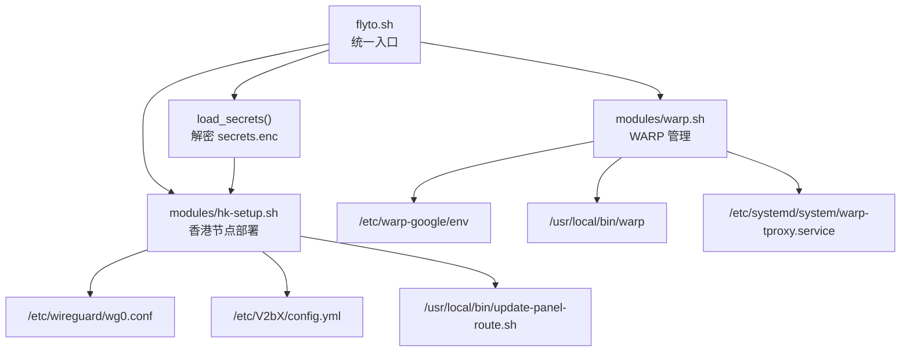
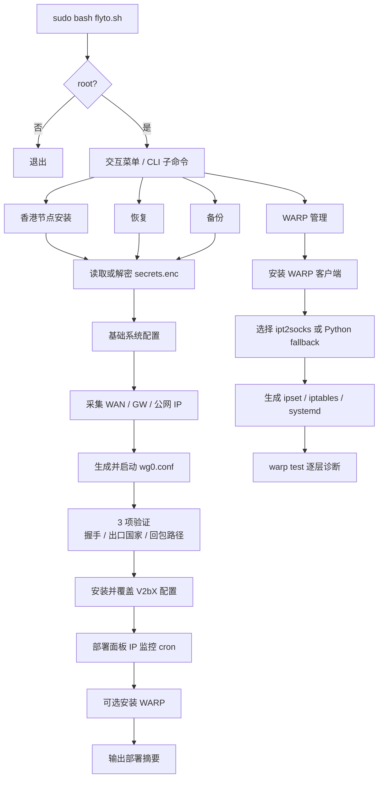

# 架构分析

本文档对应“执行 1”，用于说明项目执行流、模块职责和运行期配置落盘位置，方便后续接手、审计和改造。

## 项目定位

`flyto-network` 不是常规应用服务，而是一套高权限运维脚本集合。它的目标是在香港节点上完成以下组合部署：

- WireGuard 中转，把主动出站流量送到美国出口
- V2bX 节点管理，直连面板获取节点配置
- 可选的 Cloudflare WARP 透明代理，用于 Google / Gemini 流量送中
- 使用 `secrets.enc` 加密保存面板敏感配置

## 模块关系

## 主执行流

## 路由设计要点

- `wg0.conf` 使用 `Table = off`，避免 `wg-quick` 自动接管默认路由。
- `PostUp` 写入 `eth0rt` 路由表，确保来自香港公网 IP 的回包仍走原公网口。
- 美国 WireGuard Endpoint 和面板域名 IP 被显式加入例外路由，避免隧道自环和面板拉取失败。
- 默认路由被替换到 `wg0`，因此香港节点主动发起的新连接会走美国出口。

## 运行时配置与落盘位置

| 类型 | 生成位置 | 生成者 | 作用 |
| --- | --- | --- | --- |
| 解密缓存 | `/etc/flyto/.secrets` | `flyto.sh` | 缓存 `PANEL_API_HOST` / `PANEL_API_KEY` |
| WireGuard 配置 | `/etc/wireguard/wg0.conf` | `modules/hk-setup.sh` | 中转隧道和策略路由 |
| 状态目录 | `/etc/hk-setup/` | `modules/hk-setup.sh` | 保存 `wan_if`、`gateway`、`pub_ip`、`panel_ip` |
| 面板路由巡检 | `/usr/local/bin/update-panel-route.sh` | `modules/hk-setup.sh` | 定时刷新面板 IP 路由和 `/etc/hosts` |
| V2bX 主配置 | `/etc/V2bX/config.yml` | `modules/hk-setup.sh` | 面板接入和节点配置 |
| sing-box 路由 | `/etc/V2bX/sing_origin.json` | `modules/hk-setup.sh` | 强制 `direct` 走系统路由 |
| WARP 环境 | `/etc/warp-google/env` | `modules/warp.sh` | 唯一端口来源 |
| WARP 后端标记 | `/etc/warp-google/tproxy_backend` | `modules/warp.sh` | 标识 `ipt2socks` 或 `python` |
| WARP 命令 | `/usr/local/bin/warp` | `modules/warp.sh` | 管理命令入口 |
| WARP 透明代理服务 | `/etc/systemd/system/warp-tproxy.service` | `modules/warp.sh` | 承载透明代理后端 |
| WARP 保活定时器 | `/etc/systemd/system/warp-keepalive.timer` | `modules/warp.sh` | 每 10 分钟巡检 |

## 依赖与边界

- 平台目标：Debian 12、Ubuntu 22.04+。
- 权限要求：root。
- 网络要求：访问 GitHub、Cloudflare、Google、面板域名。
- 依赖来源：APT/YUM、Cloudflare 官方仓库、GitHub raw、GitHub releases。

## 对接手者最重要的事实

- 这是“改宿主机”的工具，不是“运行在宿主机上的业务服务”。
- 核心逻辑高度依赖 Linux 路由、iptables/ipset、systemd、cron。
- 改造时要优先保证 `wg0` 路由语义不变，否则最容易引入 SSH 断连和回包不对称问题。
